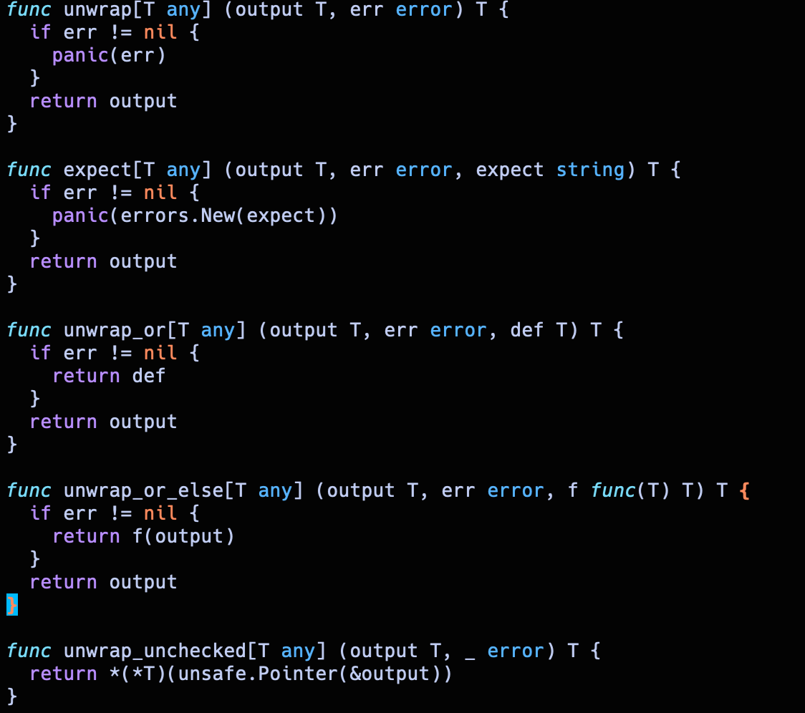

# unwrap
A forbidden Go library inspired by the std:Result library in Rust. Dont sue me!


**Please note** that this should absolutely **not** be used in to replace error handling in go. If you plan to do so, then I 
highly advise creating your own custom methods for your own desired way of handling things. This library *kinda* goes against
the Golang philosophy of directly handling errors:

> "The philosophy regarding errors is centered around simplicity, explicitness, and ease of handling. Go
> emphasizes the principle that errors should be explicitly handled rather than 
ignored or concealed." *- GPT3*

## The Good Stuff
Let's start with the most cursed of all, the basic unwrap:
```go
func main() {
  listener := unwrap.Unwrap(net.Listen("tcp", ":80"))
  handler := http.NewServeMux()

  http.Serve(listener, handle)
}
```
The above code essentially does what you would think, the ```listener``` variable receives only the outputted result
value. The value of the error is therefore disregarded (sorry Gopher). Note, that if the function being unwrapped were 
to fail or return an error, the program will panic.

But what if we wanted to be a bit *safer*?
```go
func main() {
  listener := unwrap.Wrap(net.Listen("tcp", ":80")).Or(someDefaultListener)

  ...
}
```
The ```Raw``` method wraps the returned (value, error) pair into a struct called ```Result``` returning a "raw" set of values:
```go
type Result[T any] struct {
	Value T
	Err   error
}
```
This loophole essentially allows you to perform various methods on the returned data, in this case the ```Or``` method.
Much like the ```unwrap_or``` method in Rust, if the function call were to fail- instead of panicking, 
the default value provided will be returned. If it doesn't fail, than the original output would be returned instead.

Okay, thats great and all but what if you wanted to return a custom error message?
```go
func main() {
  listener := unwrap.Wrap(net.Listen("tcp", ":80")).Expect("whelp, we broke the system")

  ...
}
```
Boom, the ```Expect``` method allows you to do just that.

But can we go deeper? Yes, we definitely can:
```go
func main() {
  listener := unwrap.Unchecked(net.Listen("tcp", ":80"))

  ...
}
```
I take it back, this is the most cursed function by far. The ```Unchecked``` method returns the Some value **without** checking 
whether it is valid or not. Basically, the epitome of a YOLO function or saying "It just works"

## Reference
Rust std::result -> https://doc.rust-lang.org/std/result/enum.Result.html
